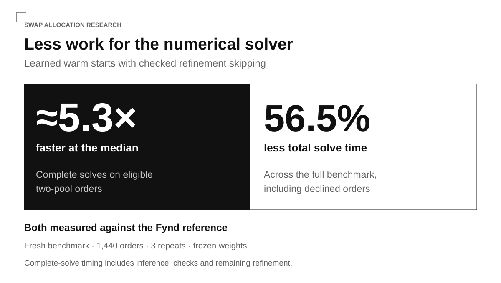
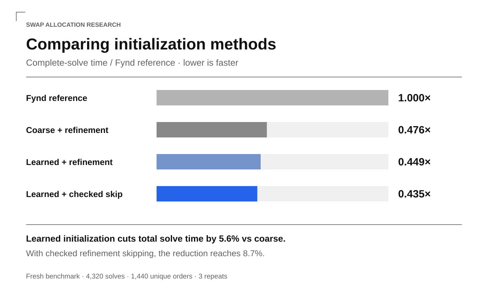

# Learned warm starts for swap allocation

## Results

Learned warm starts with checked refinement skipping achieved about 5.3× faster median complete solves on eligible two-pool orders than the Fynd reference. Across the full fresh benchmark, the method used 56.5% less total solve time, including orders where the initializer declined. These measurements cover two WETH/USDC Uniswap V3 pools on Base.

A neural allocation initializer supplies a starting split that replaces Fynd's fine allocation passes. An allocation-regret estimator screens that proposal, and a numerical refinement skip check determines whether the solver can omit refinement. Timings include this work and any refinement that remains.

On the separate held-out test, all 6,336 paired orders completed within the accepted 0.1-basis-point loss limit for output after gas. The worst observed loss was 0.01863 basis points. Complete-solver performance across other pools and market conditions remains untested.

## Methods

| Method | Behavior |
| --- | --- |
| Fynd reference | Fynd with no custom initializer; runs its coarse, fine, and refinement passes. |
| Coarse split | Start refinement from Fynd's 20-chunk split; no learned model. |
| Learned initialization | Replace both 256-chunk fine passes with a learned correction; always refine. |
| Learned warm start with checked skip | The released method. The allocation-regret estimator and six nearby quotes determine whether to skip refinement of the two-pool candidate. |
| Quadratic formula | Computes a starting split from the coarse pass using a quadratic approximation. |
| Prediction-only skip | Disabled: prediction alone failed the development quality gate. |

The neural allocation initializer is a multilayer perceptron (MLP), a feedforward network with fully connected layers, trained through supervised learning. Both it and the allocation-regret estimator have two hidden layers of 32 units and 1,281 learned parameters each. Each network selects five inputs from the seven-field representation: trade direction, order size, coarse allocation, the price gap between pools, and a quadratic correction. The two quote-failure flags are constant in the training data and are excluded. Both artifacts record the selected indices as [0, 1, 2, 3, 6].

The allocation network adjusts the coarse split by at most one twentieth of the order. It reuses the coarse pass's simulations and runs inference in Rust. Fynd still constructs the candidate routes and selects the best output after gas.

The allocation-regret estimator predicts the starting allocation's output loss against the sampled training reference; it is not a probability of correctness. If its estimate is at most 0.02 basis points and the order falls within the configured limits, the refinement skip check quotes three splits on each pool: the proposed split and its neighbors, one Q/512 step away, where Q is the order size. These six quotes bound gross-output loss assuming concave pool output. Refinement runs if the check fails. The method, named offset_certified in the code, does not bound loss after gas; that is measured by evaluating the final solver output.

## Solve time

Compared with starting from the coarse allocation alone, learned initialization reduced total solve time by 5.6%, with refinement enabled in both. Checked refinement skipping increased that reduction to 8.7%. Both alternatives replace Fynd's fine passes; this comparison measures the additional contribution of the learned starting split and the skip check.

The fresh benchmark contains 1,440 unique orders repeated three times, or 4,320 solves per method. The initializer runs on 3,378 solves. Time is the complete Solver::quote call, including discovery, coarse work, initialization, inference, refinement, and assembly. State replay occurs before timing. Methods rotate order and use fresh per-solve caches.

Each time ratio divides the method's solve time by the reference time for the same order and repeat. Median and p90 summarize those paired ratios; lower is faster. The headline speedup is the reciprocal of the eligible subset's median time ratio. Total time divides the summed method time by the summed reference time. Simulation counts come from separate instrumented runs over eligible two-pool orders, so counting does not affect timing.

| Method | All median | All p90 | Two-pool median | Total time | Simulations | Worst delta (bp) | Gate failures |
| --- | --- | --- | --- | --- | --- | --- | --- |
| Fynd reference | 1.000x | 1.000x | 1.000x | 1.000x | 606.9 | +0.00000 | 0 |
| Coarse split, always refine | 0.346x | 0.996x | 0.233x | 0.476x | 99.1 | -0.01526 | 0 |
| Neural initializer, always refine | 0.343x | 0.998x | 0.229x | 0.449x | 93.7 | -0.01526 | 0 |
| Learned warm start with checked skip | 0.307x | 0.998x | 0.189x | 0.435x | 77.9 | -0.01526 | 0 |
| Quadratic formula | 0.345x | 0.996x | 0.226x | 0.456x | 94.0 | -0.01526 | 0 |
| Prediction-only skip (disabled) | 0.272x | 0.998x | 0.180x | 0.325x | 64.0 | -0.07580 | 0 |

Output delta is the difference from Fynd's output after gas, in basis points. Negative values mean less output. A loss greater than 0.1 basis points fails the quality check, as does a failed solve when Fynd succeeds. Every order is checked, including those where the initializer declines. Prediction-only skipping remains disabled because it failed on development data, despite passing on this benchmark.

## Output quality

| Evaluation | Method | Solves | Gate failures | Worst net delta (bp) |
| --- | --- | --- | --- | --- |
| Development | Learned warm start with checked skip | 1800 | 0 | -0.002037 |
| Development | Prediction-only skip (disabled) | 1800 | 3 | -0.297617 |
| Held-out | Frozen release | 6336 | 0 | -0.018627 |

The three development failures are one order repeated three times. The checked-skip variant refused that shortcut. In the held-out runtime evaluation, 3,479 of 5,022 eligible orders skipped refinement (69.3%); their worst final net delta was -0.002721 basis points.

## Training and evaluation data

Training, validation, and test cases are split chronologically. Only orders eligible for the learned initializer produce model inputs; complete-solver evaluation also includes orders where it declines.

| Split | Chronological groups | Cases | Eligible model inputs |
| --- | --- | --- | --- |
| Training | 1–8 | 25,344 | 19,455 |
| Validation | 9–10 | 6,336 | 4,929 |
| Held-out test | 11–12 | 6,336 | 5,022 |

Training, validation, and final-test states span a single overnight sampling period. The fresh timing benchmark uses a later window, after the model was frozen, and a separate random seed for order sizes. Sizes are generated from a log-uniform distribution, spanning approximately 0.02–2,000 WETH and 50–5,000,000 USDC. Gas price is fixed at 6,000,000 wei. The orders do not represent observed trading activity, and nearby states and repeated solves are correlated.

Training targets come from a scan in Q/256 steps followed by a local search in Q/16384 steps. These are approximate targets because changes in gas cost can make a split outside the search window better. Model selection used validation data. The released allocation model was trained for 1,000 epochs with learning rate 0.001 and seed 1; its weights and skip parameters stayed fixed during final evaluation.

On an older market period, the learned starting split was farther from the sampled reference than the quadratic formula in 30 of 32 windows. Median distance was 0.119% of the order for the model and 0.053% for the formula. This diagnostic measures the starting allocation against an approximate target, before refinement. It leaves transfer to other market conditions unresolved; it does not measure final output quality.

## Reproducibility

Fynd is pinned to c7622b41d1eee5f18082dab8beed2ee2db5b7cde. All timing methods use the patched runner, with no custom initializer registered for the reference. That reference matched a separate unmodified Fynd build on allocation, gross output, gas, and net output for the checked development and fresh cases. The unmodified build was used for output comparison, not a separate timing benchmark.

The held-out quality test runs the complete Rust solver with rounded allocations and exact quotes. Final quality results come from these complete solves, rather than interpolated offline estimates. The published weights match the frozen originals byte for byte, and the tables and figures are generated from the public aggregate JSON.

The harness works with historical market data supplied by the user. Prepare training cases and compatible Fynd replay inputs from your own data stack to run new experiments. The repository documents the input formats and includes a synthetic example to get started. The reproduction guide specifies the inputs for each check.

## Codex experiment harness

The Codex experiment harness connects recipe proposals to training and evaluation; reusable autonomous orchestration remains work in progress. In a trial separate from frozen v1 development, Codex proposed a training recipe while local code kept the data splits, features, loss, and evaluation rules fixed. The proposal selected hidden layers of 16 and 16 units, 300 epochs, and learning rate 0.003. Training updated the weights in 6.56 seconds. The new candidate retained refinement on every eligible order and did not use the frozen allocation-regret estimator.

Validation replay completed 19,008 paired solves across three repeats of 6,336 orders, with 0 losses exceeding 0.1 basis points. The worst loss against Fynd was 0.03854 basis points. Candidate and frozen-model timing ran in separate passes, so their difference does not establish a speed improvement. This trial demonstrates the proposal, training, and evaluation flow on validation data. It did not use the final test or replace the frozen model.

See [the repository guide](../README.md), [reproduction instructions](../docs/reproduction.md), [machine-readable results](results.json), and [the recorded-results explorer](../demo/index.html).
